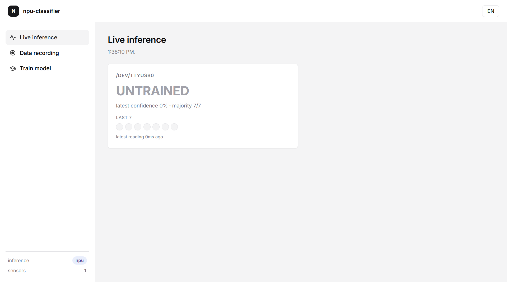
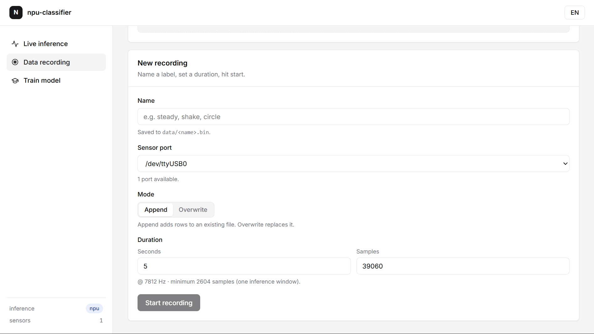
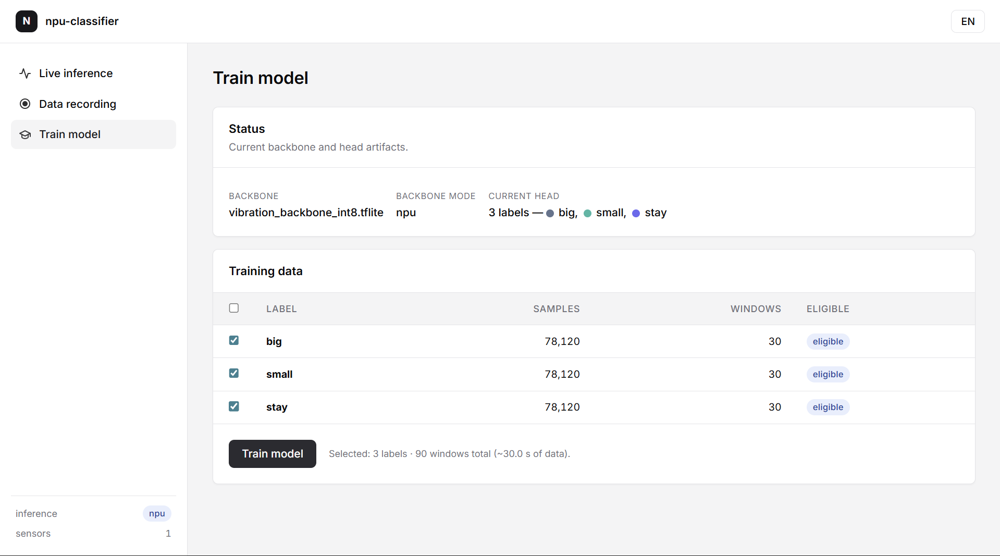

# npu-classifier

Real-time vibration classifier. A tri-axial accelerometer streams raw XYZ samples over Modbus RTU → a frozen CNN backbone extracts 128-d embeddings → a cosine-similarity head classifies motion → results appear live in a Flask dashboard. No retraining the backbone; the head is computed in seconds from your own recordings.

---

## Hardware setup

| Item | Detail |
|---|---|
| Sensor | Tri-axial accelerometer, RS485/Modbus RTU |
| Interface | USB–RS485 adapter → `/dev/ttyUSB0` |
| Baud rate | **3 Mbps** (required for raw streaming) |
| Sample rate | 7812 Hz (written to sensor register `0x01` on connect) |
| Modbus FC | FC04, register `0x02` — returns FIFO count + raw XYZ samples |

---

## Setup & launch

```bash
# 1. Create venv and install deps
python -m venv .venv
source .venv/bin/activate       # Windows: .venv\Scripts\activate
pip install -r requirements.txt

# 2. Run
python app.py                   # http://localhost:8000
FORCE_CPU=1 python app.py       # bypass NPU delegate (debug / dev machine)
```

The app auto-detects serial ports listed in `ALLOWED_PORTS` (`/dev/ttyUSB0`, `COM3`, `COM4`). One reader subprocess is spawned per detected sensor.

---

## Architecture

```
W1  sensor_reader.py   one subprocess per port
     ModbusSerialClient polls FC04 register 0x02
     decodes uint16 → int16 → /8192 → G
     emits (2604, 3) float32 windows with 50% overlap (hop=1302)
     owns RecordingManager — raw samples never cross the IPC boundary
          |
          | mp.Queue  (port, window)
          ↓
W2  inference.py        one thread, main process
     backbone: vibration_backbone_int8.tflite (NPU) or float32 (CPU)
     window → embed() → 128-d float32 embedding
     head:    classifier_head.json (cosine similarity against prototypes)
     → (class_id, similarity, class_name)
     → RollingPredictions deque (last 7 results, majority vote every 2 pushes)
          |
          | SnapshotBus (threading.Condition)
          ↓
W3  app.py + Flask      SSE push to browser on every majority-vote latch
     /                  live inference dashboard
     /record            data recording
     /train             train the classifier head
     /api/stream        SSE endpoint (EventSource)
     /api/metrics       JSON snapshot (curl debug)
```

**Inference modes** (shown in sidebar):
- `npu` — libteflon.so delegate loaded, int8 backbone on VeriSilicon NPU
- `cpu` — ai_edge_litert without delegate
- `stub` — no model file or no ai_edge_litert; returns class 0, dashboard still renders

---

## Pages

### Live inference `/`



One card per sensor port. Shows:
- **Majority class label** — winner over the last 7 inference results
- **Confidence** — cosine similarity of the latest embedding vs its prototype
- **Last 7 dots** — colour-coded per class, updated every 2 windows (~0.5 s)
- **Latest reading age** — ms since last window landed

Dashboard is SSE-driven — no polling timer, the server pushes on every vote latch.

---

### Data recording `/record`



Records raw XYZ samples to `data/<name>.bin` (float32 little-endian, 3 channels interleaved).

| Field | Detail |
|---|---|
| Name | Label name, e.g. `steady`, `shake`, `circle` |
| Sensor port | Which `/dev/ttyUSBx` to record from |
| Mode | **Append** — adds to existing file; **Overwrite** — replaces it |
| Duration | Seconds (auto-converts to sample count @ 7812 Hz) |
| Minimum | 2604 samples (one inference window) |

Progress streams via SSE (`/api/record/stream`). Writing is off the read loop — a dedicated thread flushes ~1 s chunks with `ndarray.tofile()`, so the sensor FIFO never overflows during recording.

---

### Train model `/train`



"Training" = computing one mean embedding per label. No gradients, takes seconds.

**Status panel** shows the active backbone file, inference mode, and current head labels with colour slots.

**Training data table** lists every `data/*.bin` (and legacy `*.csv`) with sample count, window count, and eligibility (minimum 6 windows = ~2 s of data).

1. Check the labels you want to include (≥ 2 required)
2. Click **Train model**
3. The backbone embeds every window at 75% overlap → prototypes averaged → `classifier_head.json` written → `InferenceWorker` hot-reloads the head with no app restart

Colour slots are randomly re-assigned on each train so you can visually confirm a retrain happened.

---

## Key files

| File | Role |
|---|---|
| `app.py` | Flask app, wires all three workers, RPC proxy to reader subprocesses |
| `sensor_reader.py` | W1 — Modbus read loop + sliding window emission + RecordingManager |
| `inference.py` | W2 — backbone embedding + head classify + hot-reload |
| `classifier.py` | ClassifierHead — cosine similarity, load/save JSON |
| `trainer.py` | TrainerManager — prototype computation, background thread |
| `recorder.py` | RecordingManager — two-stage queue, binary writer thread |
| `state.py` | RollingPredictions, SnapshotBus, LatestSlot |
| `vibration_backbone_int8.tflite` | Frozen int8 CNN backbone (NPU target) |
| `classifier_head.json` | Trained head — written by trainer, read by inference |
| `data/` | Recordings — `<label>.bin` float32 raw XYZ |

---

## Tuning knobs

| Constant | File | Default | Effect |
|---|---|---|---|
| `ROLLING_WINDOW` | `state.py` | 7 | Number of predictions in the rolling buffer |
| `DISPLAY_REFRESH_EVERY` | `state.py` | 2 | Pushes between dashboard refreshes |
| `HOP_SIZE` | `sensor_reader.py` | 1302 | Window stride (50% overlap = 4 windows/s) |
| `WINDOW_SIZE` | `sensor_reader.py` | 2604 | Samples per inference window (~1/3 s) |
| `TRAIN_HOP` | `trainer.py` | 651 | Training window stride (75% overlap) |
| `MIN_WINDOWS` | `trainer.py` | 6 | Minimum windows per label to allow training |
