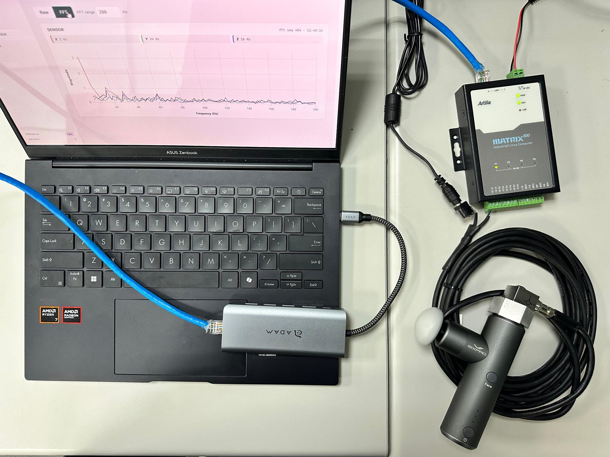

# accelerometer-demo

**English** · [繁體中文](README.zh-TW.md)

Real-time vibration monitor and motion classifier for the **Matrix800** gateway.
A tri-axial accelerometer streams raw XYZ over Modbus RTU → a frozen CNN backbone
runs on the NPU → a cosine-similarity head labels the motion → a live Flask
dashboard shows the waveform, FFT, sensor metrics, and class.

**See actual interface**: [api.md → page details](docs/api.md#page-details).

<p float="left">
    
</p>

## Quick start

```bash
git clone https://github.com/pogJames/accelerometer-demo
python -m venv .venv
source .venv/bin/activate
pip install -r requirements.txt
python app.py                   # http://<board-ip>/
```

On real hardware, **first set the NPU driver** — the one step that silently
breaks if wrong. See [getting-started.md](docs/getting-started.md#3-choose-your-npu-driver).

## Pages

| URL | Shows |
|---|---|
| `/` | Live waveform — raw scroll + FFT spectrum, per sensor |
| `/inference` | Live class cards (majority vote over the last 7 windows) |
| `/metrics` | Per-sensor metric tables (gravity / velocity / temperature) |
| `/record` | Record raw XYZ to `data/<label>.bin` |
| `/train` | Train the classifier head (2+ labels, seconds) |
| `/settings` | Per-port friendly names |

## Architecture in five lines

Three workers, decoupled by queues:

```
W1 sensor_reader.py  → queues →  W2 inference.py  →  W3 app.py
   (subprocess per port)            (NPU classify)     (Flask + SSE)
```

W1 reads Modbus in its own process (the serial loop is GIL-bound). W2 runs the
frozen int8 backbone on the NPU. W3 wires it together and pushes snapshots to the
browser over SSE. Inference mode is `npu` (real) or `stub` (runtime/model/delegate
missing — the dashboard still renders). No CPU fallback.

## Docs

| Doc | For |
|---|---|
| [getting-started.md](docs/getting-started.md) | Run it on a Matrix800 from zero |
| [api.md](docs/api.md) | HTTP/SSE API to build on top |
| [architecture.md](docs/architecture.md) | How and why it's built this way |
| [modules.md](docs/modules.md) | Per-file notes for editing internals |
