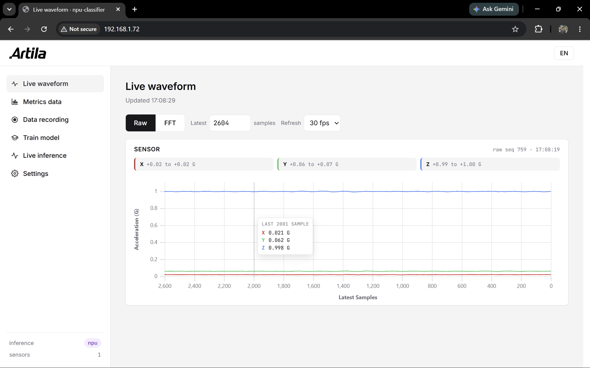
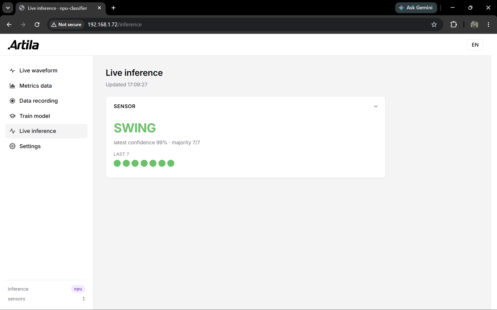
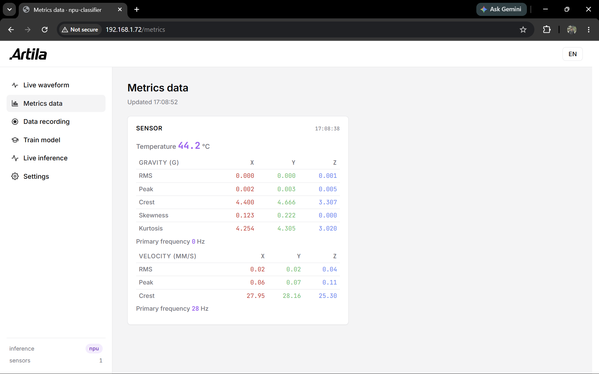
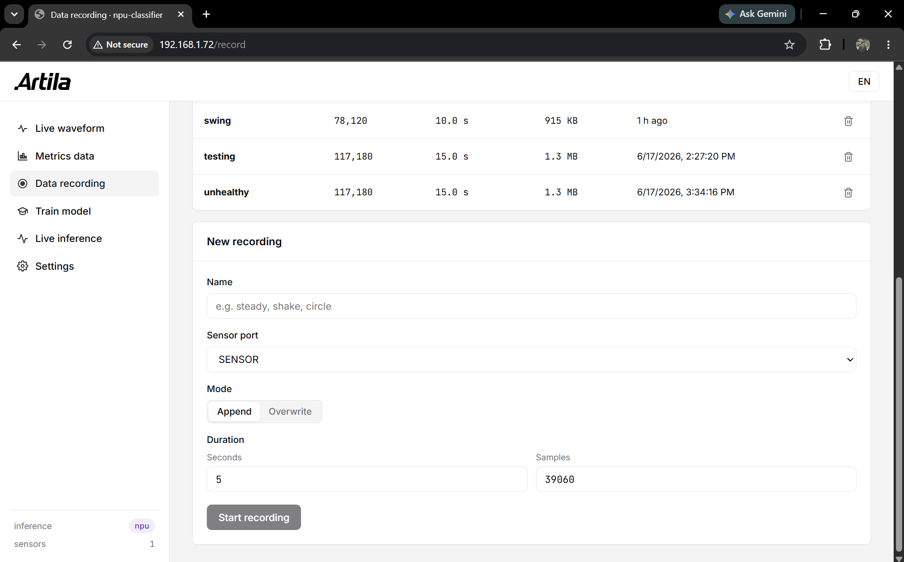
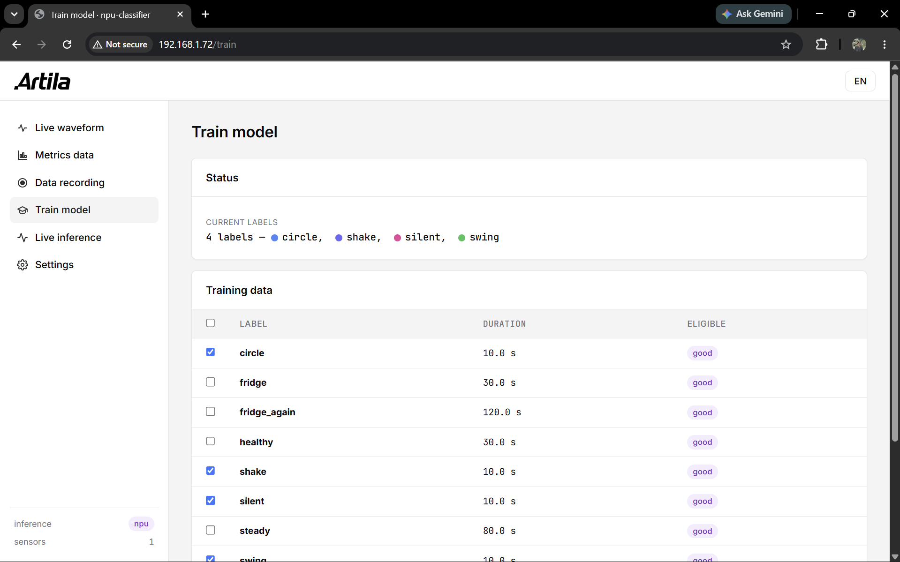

# API

The HTTP surface for building on top of the demo: dashboard pages, SSE streams,
and control endpoints.

All request and response bodies are JSON. Errors return `{"error": "..."}` with
a 4xx/5xx status. Ports are the raw `/dev/ttyUSBx` strings.

A port streams nothing until a page (or an `/api/active_port` call) activates it.

---

## Pages

| URL | Shows |
|---|---|
| `/` | Live waveform — raw scroll + FFT spectrum, per sensor |
| `/inference` | Live class cards (majority vote over the last 7 windows) |
| `/metrics` | Per-sensor metric tables (gravity / velocity / temperature) |
| `/record` | Record raw XYZ to `data/<label>.bin` |
| `/train` | Train the classifier head (2+ labels, seconds) |
| `/settings` | Per-port friendly names |

Details per page: [interface below](#page-details).

---

## SSE streams

Long-lived `text/event-stream` connections. Each `data:` frame is one JSON
snapshot, pushed on change. A comment heartbeat is sent while idle.

| Endpoint | Pushes on | Frame payload (keys) |
|---|---|---|
| `GET /stream/inference` | new majority-vote latch | `ports{<port>:{majority_class_name, majority_count, window_count, recent[], display_seq, latest_ts}}, class_labels[], label_colors{}, active_ports[], inference_mode, now` |
| `GET /stream/waveform` | 30 Hz display tick | `ports{<port>:{raw, fft, raw_seq, fft_seq, ts}}, raw_axis[], freq_axis_hz[], sample_rate, window_size, fft_bins, ...` |
| `GET /stream/metrics` | FC03 batch (~2–5 s) | `ports{<port>:{temperature, gravity{rms,peak,crest,skewness,kurtosis,primary_freq}, velocity{rms,peak,crest,primary_freq}, ts}}, open_ports[], now` |

Tail a stream from the shell:

```bash
curl -N http://<board-ip>/stream/inference
```

---

## Control and config (POST)

| Endpoint | Body | Effect |
|---|---|---|
| `POST /api/active_port` | `{port, active}` | Open/close a port for **raw waveform + inference** streaming |
| `POST /api/metrics_active` | `{port, active}` | Open/close **metrics** streaming (independent of raw) |
| `POST /api/waveform_config` | `{fft_max_hz?, raw_samples?}` | Set live waveform/FFT knobs |
| `POST /api/port_alias` | `{port, alias}` | Set a port's friendly name |

---

## Recording

| Endpoint | Body | Returns |
|---|---|---|
| `GET /api/recordings` | — | `{labels:[{name, samples, windows, eligible}], ports[], sample_rate, min_samples, min_windows, window_size, data_dir}` |
| `GET /api/record/status` | — | `{session}` or `null` (poll ~1 Hz) |
| `POST /api/record/start` | `{name, target_samples, port, mode:"append"\|"overwrite"}` | `{session}` |
| `POST /api/record/cancel` | — | `{session}` (keeps samples written so far) |
| `POST /api/recordings/delete` | `{name}` | `{deleted}` — `409` if that label is recording |

A `session` is `{status, name, port, progress, elapsed_s, samples_written, target_samples, file_path}`.

---

## Training

| Endpoint | Body | Returns |
|---|---|---|
| `GET /api/train/status` | — | `{session, head_labels[], head_colors{}, backbone, backbone_mode}` |
| `POST /api/train/start` | `{labels:[...]}` (2+ eligible) | `{session}` |
| `POST /api/train/cancel` | — | `{session}` |

---

## One-shot JSON

Non-streaming GETs that return the same payload as the matching `/stream/*`
feed, for `curl`/`jq` debugging. They reflect the current cached state whether or
not a port is active.

| Endpoint | Returns |
|---|---|
| `GET /api/inference` | Current `/stream/inference` payload |
| `GET /api/metrics` | Current `/stream/metrics` payload |
| `GET /api/waveform` | Current `/stream/waveform` payload |

```bash
curl -s http://<board-ip>/api/inference | jq
```

---

## Page details

### `/` — live waveform

<p float="left">
    
</p>

- **Raw mode** — scrolling time trace, X/Y/Z overlaid. "Latest N samples" up to
  1 s. Refresh rate 10/30/60 fps.
- **FFT mode** — magnitude spectrum, range in Hz (caps at 800 Hz).
- Per-axis stat chips (min..max in raw, peak frequency in FFT). Click a chip to
  hide/show that axis. Hover a plot for the sample value.

### `/inference` — live class

<p float="left">
    
</p>

One card per sensor. Shows the majority class over the last 7 results, the
latest confidence, and a colour-coded dot strip. SSE-driven, no polling.

### `/metrics` — metric tables

<p float="left">
    
</p>

Per-sensor card: temperature, a gravity table (RMS / Peak / Crest / Skewness /
Kurtosis × XYZ + primary freq) and a velocity table (RMS / Peak / Crest × XYZ +
primary freq). All fields update together at the slow ~2–5 s cadence.

Activating `/metrics` starts FC03 polling only, not raw streaming. Raw streaming
(from `/` or `/inference`) always preempts metric polling on the same port.

### `/record` — record data

<p float="left">
    
</p>

Records raw XYZ to `data/<name>.bin` (float32 little-endian, 3 channels
interleaved). Append or Overwrite mode. Progress streams over SSE. Each row in
the table has a delete button.

To convert a `.bin` to CSV (`x,y,z`, no timestamps):

```bash
python bin2csv.py data/<name>.bin      # also accepts a glob or a directory
```

### `/train` — train the head

<p float="left">
    
</p>

"Training" computes one mean embedding per label. No gradients, seconds. Pick 2+
eligible labels → **Train model** → `classifier_head.json` is written and the
inference worker hot-reloads it, no restart. Colour slots are re-assigned each
train.

### `/settings` — port names

One row per detected port. Type a friendly name (for example "Front-left motor");
it saves instantly to `port_aliases.json` and shows on every page. The raw
`/dev/ttyUSBx` path stays the internal ID.
